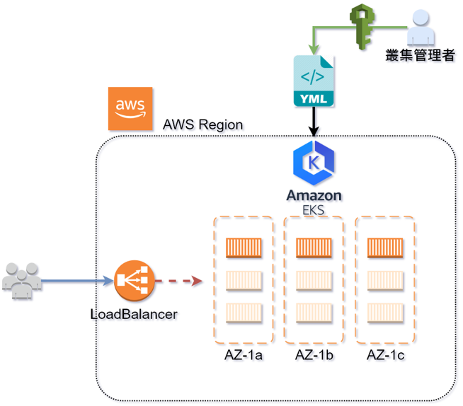
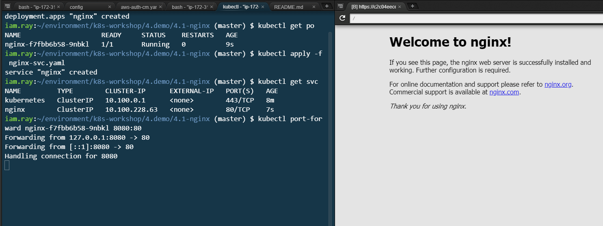

# DEMO 4.1-nginx

-  本例會運行NGINX WEB, 並說明 **kubectl 指令 : 部署, 取得資源, 埠轉發, 查看資源詳細狀態, 修改, 刪除** 等基本的用途


## 架構參考




## kubectl apply (部署)

-  透過 `kubectl apply` 部署, yaml 檔的路徑要正確, 切換到正確資料夾
   `/environment/k8s-workshop/4.demo/4.1-nginx` 
-  執行指令 `kubectl apply -f nginx-1.14.0.yaml`

```bash
# deploy with yaml file

$ kubectl apply -f nginx-1.14.0.yaml
deployment.apps "nginx" created
```


## kubectl get (取得資源)

```bash
# get pod

$ kubectl get pod
NAME                    READY     STATUS    RESTARTS   AGE
nginx-f7fbb6b58-qz9gm   1/1       Running   0          48s
```


## kubectl expose services (暴露服務)

-  要讓 nginx 可供存取, 可透過 `kubectl apply -f nginx-svc.yaml` 將服務曝露

```bash
# deploy with yaml file

$ kubectl apply -f nginx-svc.yaml
service/nginx created

# get service

$ kubectl get svc
NAME         TYPE        CLUSTER-IP     EXTERNAL-IP   PORT(S)   AGE
kubernetes   ClusterIP   10.100.0.1     <none>        443/TCP   56m
nginx        ClusterIP   10.100.199.7   <none>        80/TCP    21m
```

## kubectl port-forward (埠轉發)

-  本例提供內部的 **cluster-ip 僅供內部存取** , 因此需透過 `kubectl port-forward` 來做 port-forward

```bash
# get pod

$ kubectl get pod
NAME                     READY     STATUS    RESTARTS   AGE
nginx-7457c78b7d-frfwg   1/1       Running   0          19m

# port-forward local 8080 port to container 80 port

$ kubectl port-forward nginx-7457c78b7d-frfwg 8080:80
Forwarding from 127.0.0.1:8080 -> 80
Forwarding from [::1]:8080 -> 80
Handling connection for 8080
```



## kubectl describe (查看資源詳細狀態)

```bash
$ kubectl describe po nginx-f7fbb6b58-f7qsx
```

```yaml
Name:           nginx-f7fbb6b58-f7qsx
Namespace:      default
Node:           ip-172-31-36-51.us-west-2.compute.internal/172.31.36.51
Start Time:     Mon, 27 Aug 2018 17:48:00 +0800
Labels:         pod-template-hash=939662614
                run=nginx
Annotations:    <none>
Status:         Running
IP:             172.31.36.236
Controlled By:  ReplicaSet/nginx-f7fbb6b58
Containers:

# 以下略, 有非常長一串
```


## kubectl edit (修改)

-  可以臨時變更部署 yaml 後的參數, 修改後會立即生效, 比如將: `container image` 修改為其他版本

```yaml
spec:
  containers:
      # 部署的時候是 1.14.0 改成 1.15.0 看看
    - image: nginx:1.15.0
```


## kubectl delete (刪除)

-  測試完畢後, 刪除跟部署方式相同, 只需執行 `kubectl delete -f nginx-1.14.0.yaml` 即透過 yaml 文件刪除

```bash
# delete with yaml file

$ kubectl delete -f nginx-1.14.0.yaml 
deployment.apps "nginx" deleted

# get pod

$ kubectl get po
NAME                    READY     STATUS        RESTARTS   AGE
nginx-f7fbb6b58-qz9gm   0/1       Terminating   0          2m
```

---
# 問題思考

1.  Q: 請嘗試刪除 service 資源?  
2.  Q: 假設要將 service 改成 AWS-ELB 方式, 可以如何處理?
