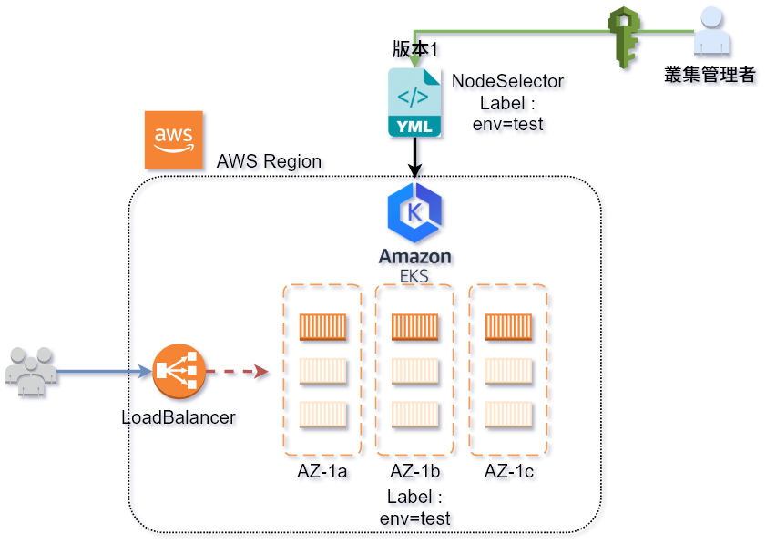

# DEMO 4.2-node-selector

本例說明 **透過標籤選擇器將 Pod 部署到指定 Node**

-  部署應用程式時, 若不特別指定, Kubernetes 會自動隨機分配 App 到仍有資源的節點去
-  如果要指定到特殊Node (如 prod, test, High-CPU, High-IO), 隨機分配會造成需求不符的問題
-  因此可透過使用 `kubectl label` 來使用 label ,將 App 指派到具有特定 label 的 Node


## 架構參考




## YAML 檔案差異

-  比較 `nginx-v1.yaml` 與 `nginx-v2-nodeSelector.yaml` 的差異?


---
## 動手做

-  請注意實際演練過程中的 **NODE 節點會不同, 請勿直接照抄**


### 取得 node 列表

```bash
# get nodes
$ kubectl get nodes
NAME                                          STATUS    ROLES     AGE       VERSION
ip-172-31-26-88.us-west-2.compute.internal    Ready     <none>    1h        v1.10.3
ip-172-31-3-130.us-west-2.compute.internal    Ready     <none>    1h        v1.10.3
ip-172-31-46-237.us-west-2.compute.internal   Ready     <none>    1h        v1.10.3
```

### 選其中一台來標示 "env=test" 的 label

```bash
# add label node, name "env=test"
$ kubectl label node ip-172-31-26-88.us-west-2.compute.internal env=test
node "ip-172-31-26-88.us-west-2.compute.internal" labeled
```

### 取得 node 列表, 並用 grep 過濾關鍵字 env=test

```bash
# get node again, and filiter env=test
$ kubectl get nodes --show-labels | grep env=test
ip-172-31-26-88.us-west-2.compute.internal    Ready     <none>    1h        v1.10.3   asgnode=true,beta.kubernetes.io/arch=amd64,beta.kubernetes.io/instance-type=t2.medium,beta.kubernetes.io/os=linux,env=test,failure-domain.beta.kubernetes.io/region=us-west-2,failure-domain.beta.kubernetes.io/zone=us-west-2b,kubernetes.io/hostname=ip-172-31-26-88.us-west-2.compute.internal
```

### 部署 nginx-v2-nodeSelector.yaml

```bash
# deploy the yaml file with label  
$ kubectl apply -f nginx-v2-nodeSelector.yaml
deployment.apps "nginx" created
```

### 取得 pod ,這次加上 "wide option"

```bash
# get pod with "wide option"
$ kubectl get po -o wide
NAME                            READY     STATUS    RESTARTS   AGE       IP              NODE
nginx-789f57fd99-49kbh          1/1       Running   0          1h        172.31.24.95    ip-172-31-26-88.us-west-2.compute.internal
```

## 刪除 label

如果 lebel 想要刪除, 可以參考以下指令

-  delete above labels from its respecitve nodes:
-  kubectl label node `<nodename>` `<labelname>-`
-  注意後面的 `env-` 參數

```bash
$ kubectl label nodes ip-172-31-7-138.us-west-2.compute.internal env-
node/ip-172-31-7-138.us-west-2.compute.internal labeled
```

---
# 問題思考

1.  Q: 同時使用多個標籤可以嗎?
2.  Q: 如果超出資源的話, 還會繼續分配到特定節點嗎?
3.  Q: 不先在 Node 打 label, 直接 kubectl apply 的話, 會怎樣?
