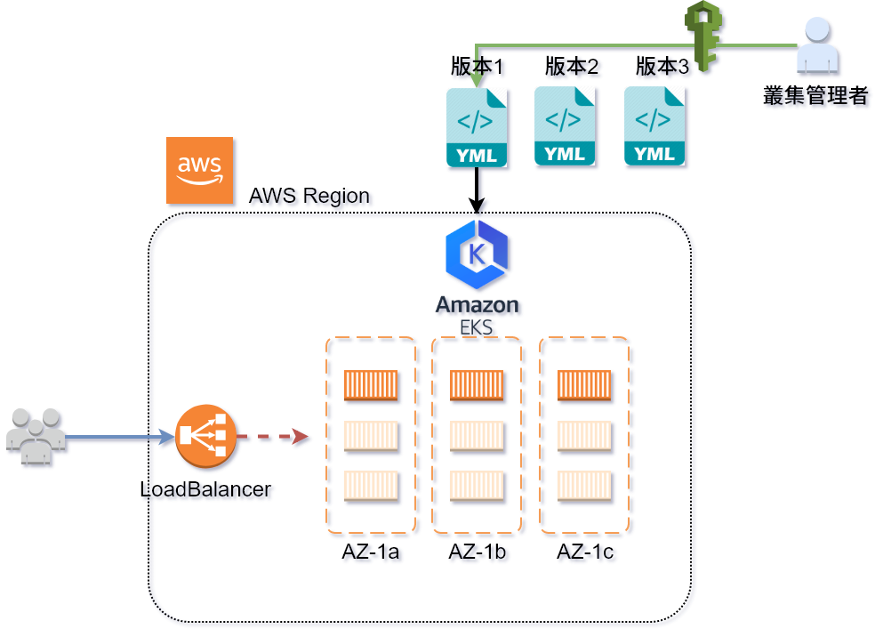

# DEMO 4.3-rolling-update

本例說明 **部署後的 Deployment rolling-update**

-  透過 rolling-update 更新目前部署環境的 container image ,達到不停機更新效果
    -  ck-httpd-v1.yaml , ck-httpd-v2.yaml, ck-httpd-v3.yaml 的差異?
    -  部署時使用 `--record` 標籤記錄變更
    -  rollout history 的用途

## 架構參考




---
## 動手做

-  請注意實際演練過程中的 **NODE 節點會不同，請勿直接照抄**

### 部署 ck-httpd-v1.yaml 與 svc-elb.yaml

```bash
# deploy
$ kubectl apply -f ck-httpd-v1.yaml 
deployment.extensions "httpd" created

# deploy service with AWS-ELB
$ kubectl apply -f svc-elb.yaml 
service "httpd" created
```

### 取得 pod, service, 這次加上 "wide option"

```bash
# get pod , service with "wide option"
$ kubectl get po,svc -o wide
NAME                         READY     STATUS    RESTARTS   AGE       IP              NODE
pod/httpd-57459d95fb-2qfx6   1/1       Running   0          50s       172.31.27.179   ip-172-31-26-88.us-west-2.compute.internal
pod/httpd-57459d95fb-4pdzt   1/1       Running   0          50s       172.31.37.28    ip-172-31-46-237.us-west-2.compute.internal
pod/httpd-57459d95fb-5xr8p   1/1       Running   0          50s       172.31.23.116   ip-172-31-26-88.us-west-2.compute.internal
pod/httpd-57459d95fb-96nx2   1/1       Running   0          50s       172.31.5.83     ip-172-31-3-130.us-west-2.compute.internal
pod/httpd-57459d95fb-x9bqw   1/1       Running   0          50s       172.31.5.106    ip-172-31-3-130.us-west-2.compute.internal

NAME                 TYPE           CLUSTER-IP       EXTERNAL-IP                                                               PORT(S)        AGE       SELECTOR
service/httpd        LoadBalancer   10.100.189.106   ae251c8d2a9c311e89d760a1b34f8803-1480467561.us-west-2.elb.amazonaws.com   80:31943/TCP   38s       app=ck
service/kubernetes   ClusterIP      10.100.0.1       <none>                                                                    443/TCP        4h        <none>
```

### 更新版本 rolling-update to ck-httpd-v2

```bash
# deploy ck-httpd-v2 with "flag --record"
$ kubectl apply -f ck-httpd-v2.yaml --record 
deployment.extensions "httpd" configured

# get pods
$ kubectl get po 
NAME                     READY     STATUS              RESTARTS   AGE
httpd-57459d95fb-2qfx6   1/1       Running             0          9m
httpd-57459d95fb-4pdzt   1/1       Running             0          9m
httpd-57459d95fb-5xr8p   1/1       Running             0          9m
httpd-57459d95fb-96nx2   1/1       Running             0          9m
httpd-57459d95fb-9m454   1/1       Running             0          6s
httpd-57459d95fb-nw2cn   0/1       Terminating         0          6s
httpd-57459d95fb-qhbwg   0/1       Terminating         0          6s
httpd-57459d95fb-qkd4h   0/1       Terminating         0          6s
httpd-57459d95fb-s289p   1/1       Running             0          6s
httpd-57459d95fb-x9bqw   1/1       Running             0          9m
httpd-957d5b677-b89tt    0/1       ContainerCreating   0          2s
httpd-957d5b677-j8mh4    0/1       ContainerCreating   0          3s
httpd-957d5b677-q7ldf    1/1       Running             0          6s
httpd-957d5b677-xm4l9    1/1       Running             0          6s
```

### 取得更新狀態

```bash
# get rollout status
$ kubectl rollout status deployment httpd
deployment "httpd" successfully rolled out
```

### 取得更新歷史

```bash
# get rollout history
$ kubectl rollout history deployment httpd 
deployments "httpd"
REVISION  CHANGE-CAUSE
1         <none>
2         kubectl apply --filename=ck-httpd-v2.yaml --record=true
```

### 回滾到之前版本

```bash
# roll-back to version 1
$ kubectl rollout undo deployment httpd
deployment.apps "httpd" 

# get pods
$ kubectl get po
NAME                     READY     STATUS              RESTARTS   AGE
httpd-57459d95fb-67f7c   1/1       Running             0          5s
httpd-57459d95fb-84fgx   1/1       Running             0          3s
httpd-57459d95fb-9kmvk   1/1       Running             0          4s
httpd-57459d95fb-dpqgt   1/1       Running             0          2s
httpd-57459d95fb-ffbpz   0/1       ContainerCreating   0          1s
httpd-57459d95fb-qss6b   1/1       Running             0          5s
httpd-57459d95fb-wwht9   0/1       ContainerCreating   0          2s
httpd-957d5b677-98q9c    0/1       Terminating         0          4m
httpd-957d5b677-b89tt    0/1       Terminating         0          4m
httpd-957d5b677-j8mh4    1/1       Running             0          5m
httpd-957d5b677-mlq7m    1/1       Terminating         0          4m
httpd-957d5b677-ncc78    1/1       Running             0          4m
httpd-957d5b677-q7ldf    1/1       Running             0          5m
httpd-957d5b677-r8d4c    0/1       Terminating         0          4m
httpd-957d5b677-sr6dr    0/1       Terminating         0          4m
httpd-957d5b677-xm4l9    1/1       Running             0          5m
```

### 取得更新歷史

```bash
# get rollout history
$ kubectl rollout history deployment httpd
deployments "httpd"
REVISION  CHANGE-CAUSE
2         kubectl apply --filename=ck-httpd-v2.yaml --record=true
3         <none>
```

## 測試後請刪除

```bash
# delete service
$ kubectl delete -f svc-elb.yaml 
service "httpd" deleted

# delete ck-httpd-v1
$ kubectl delete -f ck-httpd-v1.yaml
deployment.extensions "httpd" deleted

# check again
$ kubectl get svc,deploy
NAME                 TYPE        CLUSTER-IP   EXTERNAL-IP   PORT(S)   AGE
service/kubernetes   ClusterIP   10.100.0.1   <none>        443/TCP   4h
```


---
# 問題思考

1.  Q: 更新可以用 `kubectl edit` 處理嗎? 會有什麼問題?
2.  Q: 如果版本眾多, 應如何更新到指定版本?