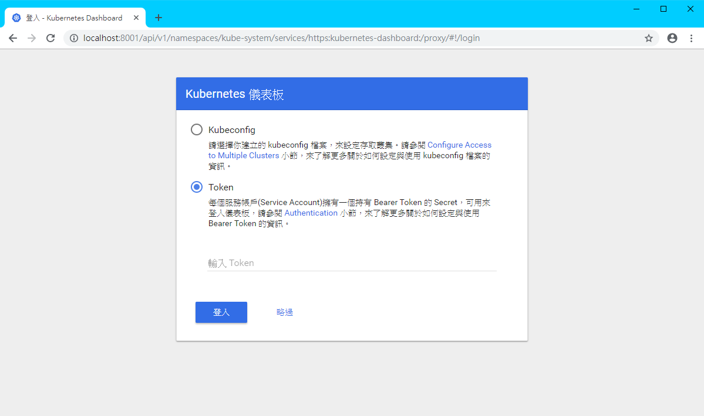
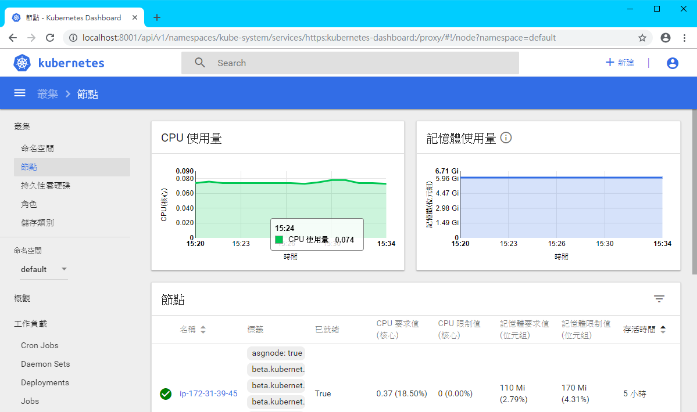

# Kubernetes Dashboard

**Cloud9 無法直接連線到 localhost, 因此這邊的測試需使用本機 (筆電/桌機) 來當作 kubectl client**

-  預先安裝套件:
    -  kubectl <https://kubernetes.io/docs/tasks/tools/install-kubectl/> 
    -  heptio-authenticator-aws <https://github.com/kubernetes-sigs/aws-iam-authenticator/releases>
    -  awscli <https://aws.amazon.com/tw/cli/>
  

## 動手做

### 部署

```bash
$ kubectl apply -f ~/environment/k8s-workshop/5.k8s-dashboard/aws-official
```

### 取得 token

```bash
$ kubectl -n kube-system describe secret $(kubectl -n kube-system get secret | grep eks-admin | awk '{print $1}')
```

### 啟動 kubectl proxy

```bash
$ kubectl proxy
```

### Connect Kubernetes Dashboard

在電腦瀏覽器貼上以下URL  
<http://localhost:8001/api/v1/namespaces/kube-system/services/https:kubernetes-dashboard:/proxy/>


貼上剛剛取得的 Token 即可登入 Dashboard

