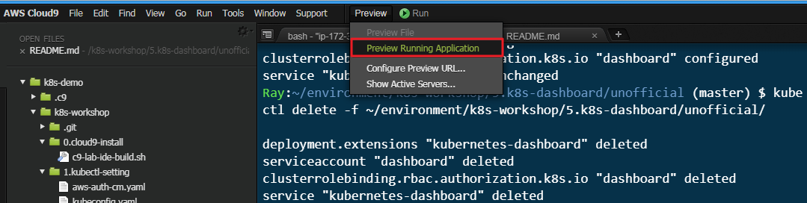
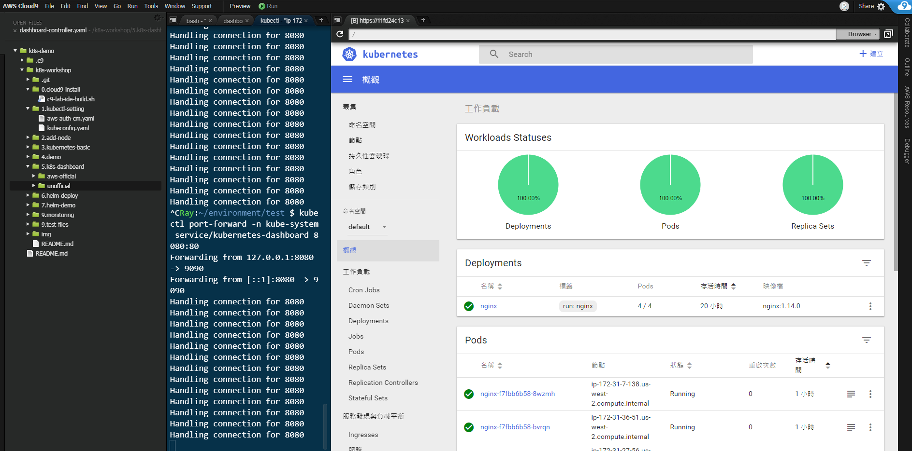

# Kubernetes Dashboard

## 動手做

### 部署

```bash
$ kubectl apply -f ~/environment/k8s-workshop/5.k8s-dashboard/unofficial/
```

### 取得 service

```bash
$ kubectl get svc -n kube-system
```

### 使用 port-forward 導向

```bash
$ kubectl port-forward -n kube-system svc/kubernetes-dashboard 8080:80
```

### 透過 cloud9 連線查看 kubernetes dashboard

-  啟動 Cloud9 的網頁預覽


-  查看 dashboard



### 刪除

-  請嘗試自行刪除看看!