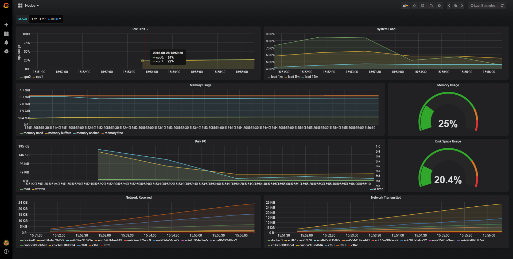

# Prometheus

-  官方導覽  <https://prometheus.io/>
-  中文說明  <https://hk.saowen.com/a/80edfc83eddc714eaceffd399e4ee8137f226817f59423b706f0db7180159ee8>
-  其他專案  
    -  <https://github.com/camilb/prometheus-kubernetes>
    -  <https://itnext.io/kubernetes-monitoring-with-prometheus-in-15-minutes-8e54d1de2e13>

## 使用 HELM 安裝 Prometheus

-  參考資料源自
<https://medium.com/getamis/kubernetes-operators-prometheus-3584edd72275>
-  如需了解詳細資料請至原網站查看

## 安裝後的成果 (需等候一段時間才有較好的視覺呈現)
)
