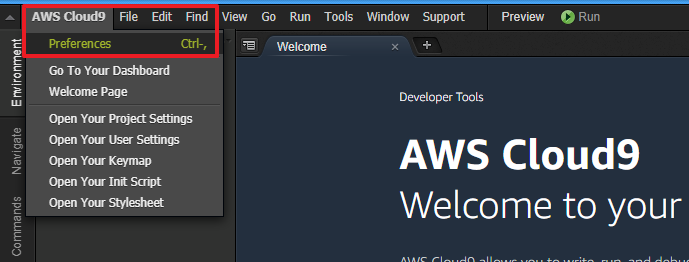
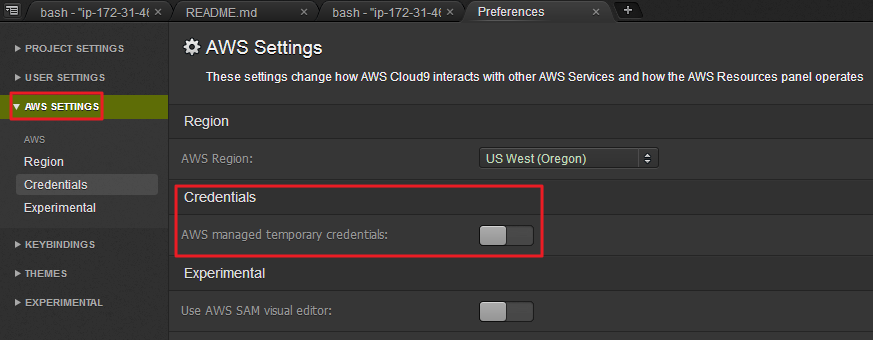

# Amazon EKS 建置流程 (使用 AWS Cloud9 做為 IDE 環境)

# 準備工作

- **不要用"公司帳戶或正式環境"的 AWS 帳戶來測試**
- **實作選擇 US West (Oregon), us-west-2**
- **使用具有 AWS Admin 權限的帳戶**


# 注意事項

- **假設登入AWS 帳戶的 IAM 使用者為 abc, 需在該使用者的 IAM 產生 `AccessKey`**
- **測試完畢後務必刪除 AccessKey 與相關的服務**


---
### Cloud9 的初始化設定

1.  Cloud9 開啟後, 於終端機貼上指令: `git clone https://github.com/ckmates/k8s-workshop.git`
2.  進入 `0.cloud9-install` 資料夾, 執行 `sh c9-lab-ide-build.sh`, 執行完畢後請登出 (CTRL+D), 並重新開另一個終端機視窗 (ALT+T)


### Cloud9 的其它設定

-  Cloud9 的設定視窗在左上角 
-  關閉 Cloud9 自帶的 Temp Credential   
-  調整文字大小顏色, 以個人舒適為主


### Cloud9 設定 AWS-CLI

1.  先在 IAM 產生金鑰, 記下備用
2.  設定 `aws cli`, 輸入 `aws configure` 進行設定

```bash
     $ aws configure
     AWS Access Key ID [ ***YOUR IAM ID*** ]: 
     AWS Secret Access Key [ ***YOUR IAM KEY*** ]: 
     Default region name [us-west-2]:
     Default output format [None]:
```

3.  設定完畢後, 可測試一下 aws-cli 是否可以正常使用, `aws s3 ls`,  
    應該可以看到一些S3 Bucket 輸出 (沒有的話可能該帳戶沒有任何 S3 Bucket)


---
## 建立 Amazon EKS Cluster

### 建立流程

1.  建立 IAM ROLE 並賦予 EKS 權限  
  
  
參考: <https://docs.aws.amazon.com/zh_tw/eks/latest/userguide/getting-started.html>  

2.  切換到 `EC2介面`, 建立 `SecurityGroup`, 名稱 `EKS-Master`, `僅允許 https 443`即可  
3.  切換到 `EC2介面`, 建立 `SSH key`  
4.  切換到 `EKS面板`, 建立 `Cluster`, 依順序輸入  
5.  等候 `EKS面板` 出現 `ACTIVE`, 建立的過程 `~10min`  
6.  找到 `EKS面板` 的 `API server endpoint` 與 `Certificate authority`,複製起來備用  


### 設定 kubeconfig

1.  Cloud9 初始化時, 已將空白的 `config` 複製到 `/home/ec2-user/.kube/config`
2.  因此可直接使用 Cloud9 來編輯 `config` , 或使用 `vim /home/ec2-user/.kube/config`

找到 `server, certificate-authority-data, args` 欄位, 修改成自己的設定, 其它欄位不要修改

```yaml
server: < 從 EKS 取得的 API Endpoint, 要帶 https:// >
certificate-authority-data: < 從 EKS 取得的 Certificate, 不要斷行 >

args:
  - "token"
  - "-i"
  - "< 建立 EKS 時的名稱 >"
```  

5.  存檔後在終端機輸入 `kubectl config view` 看設定值是否正確傳入  
6.  `kubectl get svc` 可測試是否能呼叫到 EKS, 如沒有問題, 應該會出現類似以下的訊息:

```bash
NAME         TYPE        CLUSTER-IP   EXTERNAL-IP   PORT(S)   AGE
kubernetes   ClusterIP   10.100.0.1   <none>        443/TCP   7h
```

### 使用 Cloudformation 建立 Node

1.  從 Cloud9 左側目錄找到 `2.add-node` 資料夾
2.  選擇 `eks-nodegroup-v2.yaml` 按下右鍵, 選擇 `Download` 到電腦的桌面
3.  回到 AWS, 選擇 `Cloudformation`, `Upload a template to Amazon S3`, 上傳剛下載到桌面的 `eks-nodegroup-v2.yaml`
4.  依序填入 EKS 設定欄位, EC2 instances 已經預設 `t2.medium, Spot Instances` 可以節省費用
5.  完成後, Cloudformation 開始建立 Node, 過程約 `10min`, 稍候在 Cloudformation 取得 `Outputs Value`


### 將 Node 加入 EKS 叢集

1.  修改 `aws-auth-cm.yaml`, 空白檔案已位於 `/home/ec2-user/.kube/`, 修改方式與 `kubeconfig` 相同
2.  只要調整 `- rolearn: <ARN of instance role (not instance profile)>`, 將之取代為 `cloudformation outputs value` 即可
3.  在此目錄下 `/home/ec2-user/.kube/` 使用 `kubectl apply -f aws-auth-cm.yaml` 讓 EKS 將 EC2-Node 加入


### 確認 EKS 狀態

1.  約30sec後, 使用 `kubectl get nodes`, 應可取得 Node, 狀態 Ready, 即完成 EKS 環境的建置

```bash
NAME                                         STATUS    ROLES     AGE       VERSION
ip-172-31-1-30.us-west-2.compute.internal    Ready     <none>    3h        v1.10.3
ip-172-31-20-21.us-west-2.compute.internal   Ready     <none>    3h        v1.10.3
ip-172-31-42-29.us-west-2.compute.internal   Ready     <none>    3h        v1.10.3
```